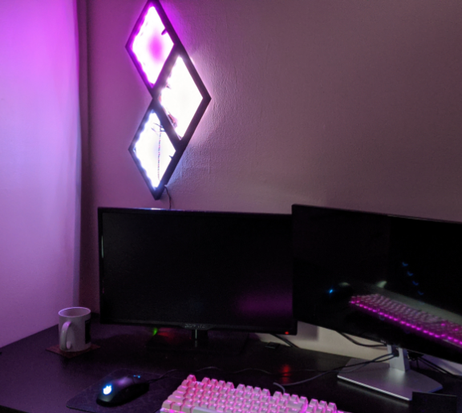
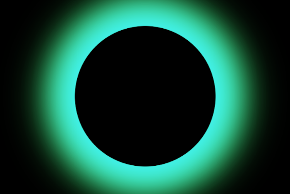
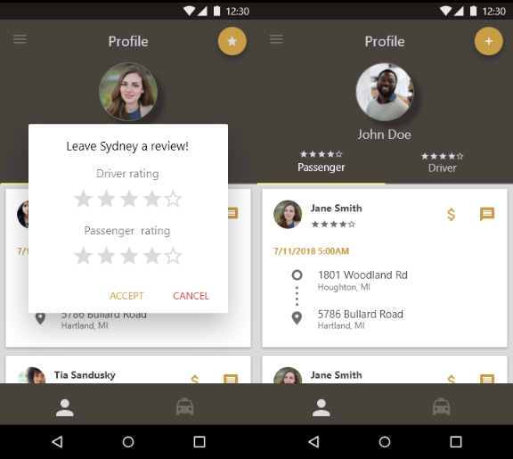
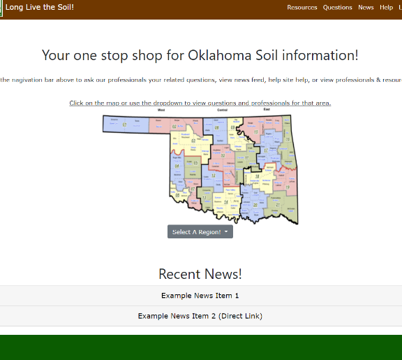
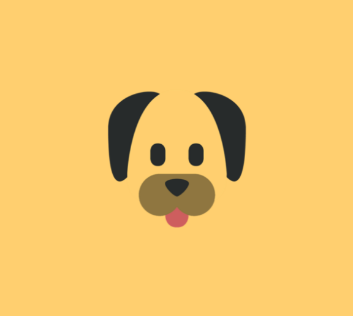

<!-- Main -->

<!-- One -->
<!-- <section id="one">
	

		<header class="major">
			<h2>Sed amet aliquam</h2>
		</header>
		
Nullam et orci eu lorem consequat tincidunt vivamus et sagittis magna sed nunc rhoncus condimentum sem. In efficitur ligula tate urna. Maecenas massa vel lacinia pellentesque lorem ipsum dolor. Nullam et orci eu lorem consequat tincidunt. Vivamus et sagittis libero. Nullam et orci eu lorem consequat tincidunt vivamus et sagittis magna sed nunc rhoncus condimentum sem. In efficitur ligula tate urna.

	

</section> -->

<!-- Two -->

<!-- DiaLights -->
<section id="two" class="spotlights">
	<section>
		
		

			

				<header class="major">
					<h3>DiaLights</h3>
				</header>
				
Arduino RGB wall art controlled through Bluetooth with Android application .

				<ul class="actions">
					<li><a href="dialights.html" class="button">Learn more</a></li>
				</ul>
			

		

	</section>
<!-- AuroraCast -->
	<section>
		
		

			

				<header class="major">
					<h3>AuroraCast</h3>
				</header>
				
Web application to predict aurora borealis visibility.

				<ul class="actions">
					<li><a href="auroracast.html" class="button">Learn more</a></li>
				</ul>
			

		

	</section>
<!-- HGD -->
	<section>
		
		

			

				<header class="major">
					<h3>Husky Game Development</h3>
				</header>
				
Multiple games developed over one to two semesters using the Unity engine.

				<ul class="actions">
					<li><a href="hgd.html" class="button">Learn more</a></li>
				</ul>
			

		

	</section>
<!-- RideShare -->
	<section>
		
		

			

				<header class="major">
					<h3>Ride Share </h3>
				</header>
				
Design boards for mobile carpooling application.

				<ul class="actions">
					<li><a href="rideshare.html" class="button">Learn more</a></li>
				</ul>
			

		

	</section>
<!-- Soil Forum -->
	<section>
		
		

			

				<header class="major">
					<h3>Soil Forum</h3>
				</header>
				
Forum and information hub developed for the Oklahoma Conservation Commission.

				<ul class="actions">
					<li><a href="ruby-forum.html" class="button">Learn more</a></li>
				</ul>
			

		

	</section>
<!-- PupAlert -->
	<section>
		
		

			

				<header class="major">
					<h3>PupAlert</h3>
				</header>
				
Social media Android application.

				<ul class="actions">
					<li><a href="pupalert.html" class="button">Learn more</a></li>
				</ul>
			

		

	</section>

</section>

